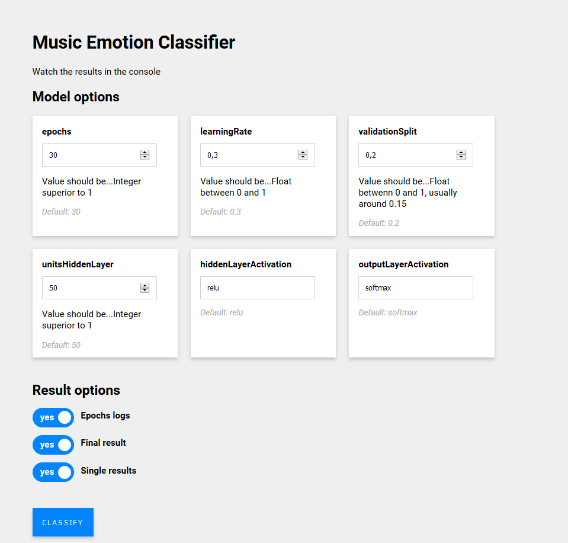

# Music Emotion Classifier

## Description 
Classifies musics and sounds into 4 emotions: happy, calm, angry or sad, depending on the music features, using Tensorflow.js.

The classification is based on [a dataset of already classified sounds](https://github.com/danz1ka19/Music-Emotion-Recognition/blob/master/Emotion_features.csv) by danz1ka19.



## Usage

### 1. Extract the features of your sound files
- Download the [Music-Emotion-Recognition](https://github.com/danz1ka19/Music-Emotion-Recognition) repo.
- Create a "Dataset" folder at the root of the folder, and put the mp3 files you want to classify in it.
- Launch the `Feature-Extraction.py` script with the command line (might take few minutes if you have a lot of files).

```python
py Feature-Extraction.py
```

- It generates an `Emotion_features.json` file at the root of the folder.

### 2. Add the sound features
- Download this repo.
- Run `npm install`.
- Place the generated `Emotion_features.json` file in the `toClassify` folder.

### 3. Tune the model
- Change the default options of the model in `scripts/classifier.ts`, at the declaration of the `classify()` function, or directly with the form (next step).

### 4. Run 
- Run with using `npm start` at the root of the project.
- You can access the results in the console at `http://localhost:1234`, with Google Chrome.
- You can also tune the model here, by entering your own parameters and pressing the "Classify" button. There is no checking for the values entered here so be careful.
- The results will appear in the console.


### Credits

Development by Mathilde Buenerd.

Based on [this dataset and feature extractor](https://github.com/danz1ka19/Music-Emotion-Recognition) by danz1ka19.
